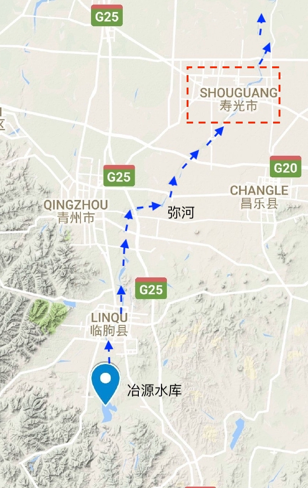

```{r setup, include=FALSE}
knitr::opts_chunk$set(echo = FALSE,
                      message = FALSE,
                      warning = FALSE)
```


```{r}
require(knitr)
require(tidyverse)
require(showtext)
font_files()
showtext_auto(enable = TRUE)
font_add('Songti', 'Songti.ttc')
```


**长文枯燥预警，本文从严禁角度出发，趣味性稍显不足，请慎入**

## 1. 前言

前几天写的一篇回答突然成了爆款文，这让笔者始料不及。由于当时数据不足，时间有限，同时广大知友提出了很多疑问，笔者从新开一篇文章，详细复盘一下冶源水库(数据相对最充足)的操作，以期待澄清更多的误会。

在全文之前，有几点前期准备工作，希望大家认真读一下:

a. **请不要开“上帝视角”**

在洪水过程中，所有人都是缺乏信息的，当时的人不知道雨什么时候来(天气预报啥时候准过？)、不知道雨啥时候走、不知道下半年会是干旱还是继续洪涝，所以所有的操作都是从最稳妥的角度出发的。笔者会在下文章详细分析每个可能操作的原因。

b. **天气预报不能作为洪水调度的决定性依据**

原因很简单，准确度不高。这里不是在低估气象工作者的工作，大气系统变化非常迅速，精确地实时预测天气状况本来就是非常具有挑战性的工作，希望大家理解。

c. **水库保障安全的最大优先级是自身的大坝**

继续强调这一点。

d. **水库不仅可以拦蓄洪水，更可以调峰滞峰**

水库防洪不仅仅是将洪水存在水里，而且可以调涨洪峰的最大值和出现时间，以减少洪峰造成的伤害。

## 2. 数据来源和处理方法

### 2.1 冶源水库和寿光市地理位置

冶源水库位于山东省临朐县弥河上游，是一座具有防洪、灌溉、养殖和发电综合利用的大型水库[1]。水库下游的弥河流经临朐县城，然后向西北经过山东寿光市。本次洪水的主要受灾区域就在寿光市上口镇口子村等地。

```{r}

```

图1 冶源水库和寿光市示意图

### 2.2 数据来源

本文数据分为三部分：山东水文站的网站、某位知友的视频截图和网上的各种公开信息。

* 水文站的数据是实时更新的，不过可以写一个爬虫(即自动搜索下载插件)来搜索往期的数据，具体细节不表。

* 某位知友的数据截取某当地专家公开的数据，笔者校验过，虽然入流数据存在一些误差，但是还在允许范围内；出流数据准确度很高。数据精度为一小时，能够提供更多细节。

* 网上的公开信息主要参考某位知友的答案，同时提供一些辅助信息。

### 2.3 水位流量关系图

一般水库的水位流量关系图是查不到的，笔者根据山东水文站的数据，拟合了一个水位流量关系曲线。需要注意的是，这个估计是可能存在一些误差的。

```{r}
# import data
flow_storage <- read.csv("./Data/yc_plot.csv")

# fit quadralic regression.
fit <- lm(storage ~ level + I(level^2), data = flow_storage)
# reference:
# https://stackoverflow.com/questions/23334360/plot-polynomial-regression-curve-in-r
prd <- data.frame(level = seq(from = range(flow_storage$level)[1], to = range(flow_storage$level)[2], length.out = 100))
err <- predict(fit, newdata = prd, se.fit = TRUE)

prd$lci <- err$fit - 1.96 * err$se.fit
prd$fit <- err$fit
prd$uci <- err$fit + 1.96 * err$se.fit

ggplot(prd,aes(x = level, y = fit)) +
  theme_bw(base_size = 18) +
  geom_line(aes(color = "拟合曲线")) +
  #geom_smooth(aes(ymin = lci, ymax = uci, color = "fitted"), stat = "identity", linetype = "dashed",se = FALSE ) +
  geom_point(data = flow_storage, aes(x = level, y = storage, color = "实测数据点"))+
  scale_color_discrete(name = NULL)+
  theme(legend.justification = c(0,0), legend.position = c(0.2,0.7))+
  scale_x_continuous(name = "水库水位(m)")+
  scale_y_continuous(name = "水库库容(百万立方米)")

```

图2 山东省冶源水库水位流量关系曲线拟合图

根据图2，笔者拟合的曲线为$storage = 0.5445*level^2 - 135.7698*level + 8466.8878$, 其中level是水库水位(m)，storage是水库库容(百万立方米)。 根据拟合曲线，笔者校核了水库的一些关键水位[2]，如图3所示。

```{r}
# import data.
test_storage = readODS::read_ods("./Data/Test_level_storage.ods", col_names = T)
res_levels = factor(test_storage$Level)
item = test_sotrage$Item
# add test data.
test_storage = test_storage %>% 
  mutate(Storage_prd = 0.5445*Level^2 -135.7698 *Level + 8466.8878) %>% 
  # wide to long
  gather(Storage_type, Value, Storage:Storage_prd)

# plot test data.
ggplot(test_storage, aes(x = factor(Level))) +
  theme_bw(base_size = 18) +
  geom_col(aes(y = Value, group = Storage_type, fill = Storage_type), position = "dodge2")+
  annotate("text", x = res_levels, y = rep(188, 5), label = c("死水位", NA, "防洪限制水位(旧)", "防洪限制水位", "允许最高蓄水位"), parse = T)+
  #geom_text(x =  factor(test_storage$Level),y = 190, label = c("死水位", NA, "防洪限制水位(旧)", "防洪限制水位", "允许最高蓄水位"))+
  coord_flip()+
  theme(legend.justification = c(0,0), legend.position = c(0.5,0.2))+
  scale_fill_discrete(name = NULL, labels = c("实测库容","拟合库容"))+
  labs(y = "水库库容(百万立方米)", x = "水库水位(m)")+
  scale_y_continuous(limits = c(0, 200))+
  NULL
```

图3 实测水库库容与拟合库容的比较

### 2.4 时间轴

本文主要依据洪水发展的时间轴进行的，从2018年8月16日开始至2018年8月22日结束，其中8月19日8时至8月22日8时是本文分析的重点时期，笔者根据相关的泄洪操作将这72小时分为

