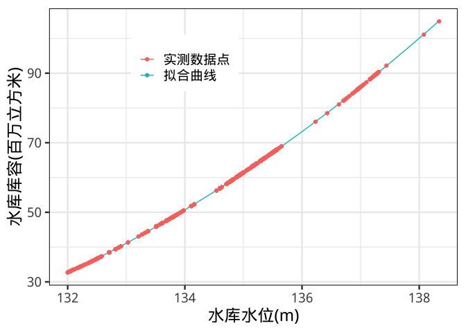
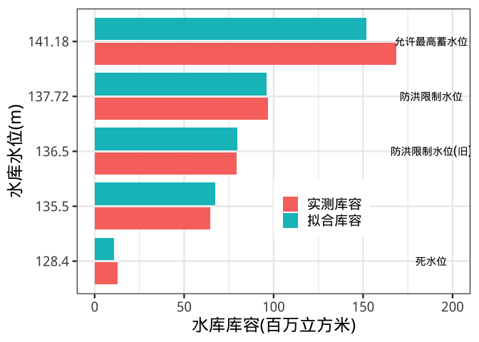
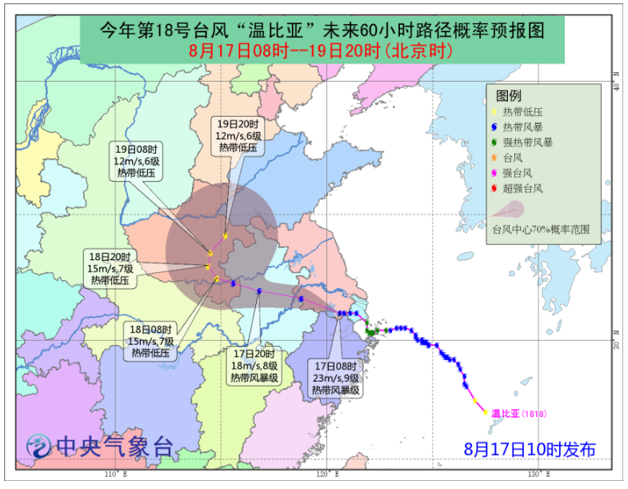
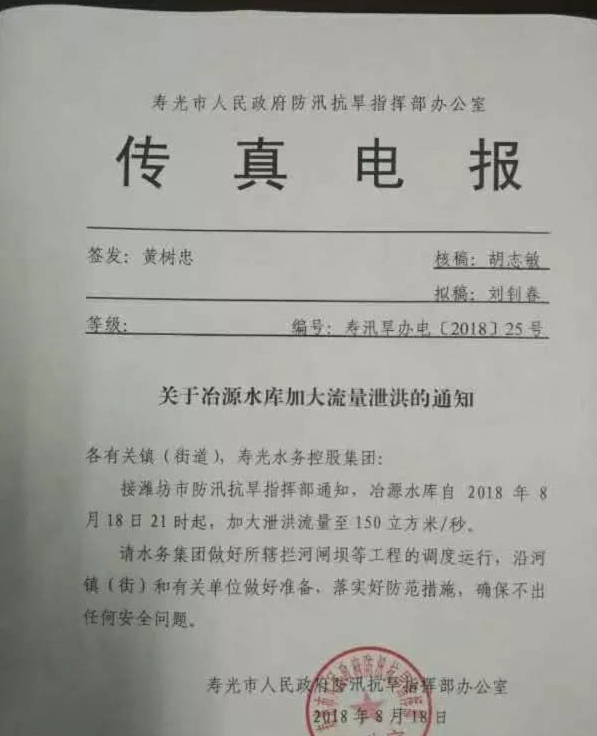
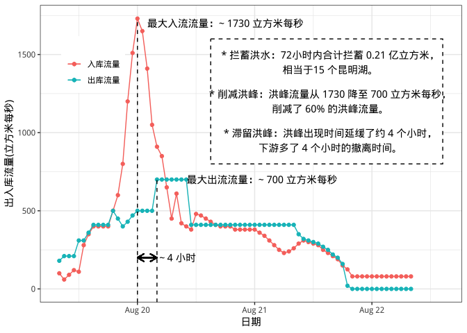
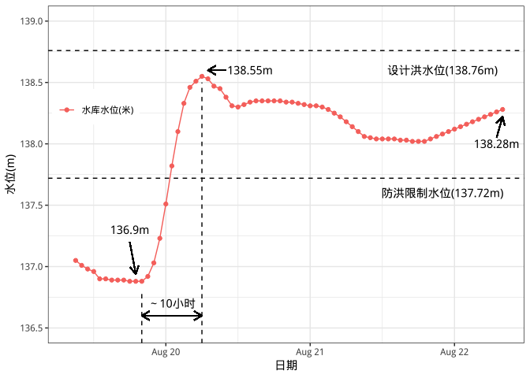

yeyuan\_review
================
Wenlong Liu
9/6/2018

## 0\. 精简版

本文根据公开的信息和数据，挖掘了冶源水库在寿光洪水中的操作过程，分析了进出库流量和水库水位变化过程。主要结论包括：

  - 冶源水库已经在台风来临之前开始泄洪，没有出现**为了一些“经济利益”故意维持水库蓄水的情况**；
  - 此次洪水出现非常迅速，冶源水库在**拦蓄洪水、削减和滞留洪峰等方面做出了很多贡献**；
  - 冶源水库在寿光洪水洪峰过后(8月22日8时)，水库的水位仍然很高(~138.2m)，**没有出现“水库放空到库底“的情况**。
  - 总体上，冶源水库在此次洪水的调度是符合规定的。

本文旨在澄清一些误会与误解，难免挂一漏万；如有不足之处，欢迎读者指出。另外，本文是一篇*可重现文章* (reproducible
output)，所有的数据、结果和分析过程都是公开并且可以重复的，欢迎点击**查看原文**查阅相关内容。

**长文枯燥预警，本文从严谨角度出发，趣味性稍显不足，请慎入**

## 1\. 前言

前几天写的一篇回答突然成了爆款文，这让笔者始料不及。由于当时数据不足，时间有限，同时广大知友提出了很多疑问，笔者重新开一篇文章，详细复盘一下冶源水库(数据相对最充足)的操作，以期待澄清更多的误会。

在全文之前，有几点背景知识，希望大家读一下:

#### **请不要开“上帝视角”**

在洪水过程中，所有人都是缺乏信息的，当时的人不知道雨什么时候来(天气预报准确度不足)、不知道雨啥时候走、不知道下半年会是干旱还是继续洪涝，所以所有的操作都是从最稳妥的角度出发的。

#### **天气预报不能作为洪水调度的决定性依据**

原因很简单，准确度不高。这里不是在低估气象工作者的工作，大气系统变化非常迅速，精确地实时预测天气状况本来就是非常具有挑战性的工作，希望大家理解。

#### **水库保障安全的最大优先级是自身的大坝**

继续强调这一点。

#### **水库不仅可以拦蓄洪水，更可以调峰滞峰**

水库防洪不仅仅是将洪水存在水里，而且可以调涨洪峰的最大值和出现时间，以减少洪峰造成的伤害。

## 2\. 数据来源和处理方法

### 2.1 冶源水库和寿光市地理位置

冶源水库位于山东省临朐县弥河上游，是一座具有防洪、灌溉、养殖和发电综合利用的大型水库。水库下游的弥河流经临朐县城，然后向西北经过山东寿光市。本次洪水的主要受灾区域就在寿光市上口镇口子村等地。

<!-- -->

图1
    冶源水库和寿光市示意图

### 2.2 数据来源

本文数据分为三部分：山东水文站的网站、某位知友的视频截图和网上的各种公开信息。

  - 水文站的数据是实时更新的，不过可以写一个爬虫(即自动搜索下载插件)来搜索往期的数据，具体细节不表。

  - 某位知乎知友的数据截取某当地专家公开的数据，笔者校验过，虽然入流数据存在一些误差，但是还在允许范围内；出流数据准确度很高。数据精度为一小时，能够提供更多细节。

  - 网上的公开信息，例如汛情电报、相关媒体报道等。

(所有等材料都看在**阅读原文**中查看)。

### 2.3 水位库容关系图

一般水库的水位库容关系图是查不到的，笔者根据山东水文站的数据，拟合了一个水位库容关系曲线。需要注意的是，这个估计是可能存在一些误差的。

<!-- -->

图2 山东省冶源水库水位库容关系曲线拟合图

根据图2，笔者拟合的曲线为

\[
storage = 0.5445*level^2 - 135.7698*level + 8466.8878
\]

其中level是水库水位(m)，storage是水库库容(百万立方米)。

根据拟合曲线，笔者校核了水库的一些关键水位，发现在137.72m以下的库容中，拟合曲线预测的较好；对于高水位的洪水，例如141m以上，拟合曲线会低估水库库容。

鉴于一般情况下水库是不会达到允许最高蓄水位，所以现有的拟合关系曲线是可以接受的。

<!-- -->

图3 实测水库库容与拟合库容的比较

### 2.4 水库水位估算方法

根据现有的出入库流量数据，我们可以通过上文的水位库容关系曲线来估算水库在洪水时期的实时水位。估算的起始点是2018年8月19日9时，水库库存为
0.8685 亿立方米，水库水位是 137.05 m。

  - 随后的逐个小时计算出入库水量，计算方法是出入流量乘以3600
(需要注意的是，这个估算方法可能会引入一些误差)；

  - 初始水库库容减去每个小时的水库出入库水量差值，即是每个小时的估算水库库容；

  - 通过估算水库库容和拟合的水位库容曲线即可推算每小时的估算水库水位。

估算的水库和库容与水文系统通报的数据吻合较好；在洪水后期，估算的数据高估了水库的库容和水位，可能的原因包括：粗糙的水量估算方法、入库洪水的测量不太准确、从原始图表截图时存在误差等。但是这些误差并不影响后边的结论，下文将使用估算的数据进行分析。

### 2.5 时间轴

本文主要依据洪水发展的时间轴进行的(8月12日至8月22日)，主要分为三段：

| 时间轴  | 起始时间             | 结束时间             |
| ---- | ---------------- | ---------------- |
| 洪水前期 | 2018-08-02 8:00  | 2018-08-19 8:00  |
| 洪水过程 | 2018-08-19 8:00  | 2018-08-21 21:00 |
| 洪水后期 | 2018-08-21 21:00 | 2018-08-22 8:00  |

## 3\. 洪水前期分析

这次寿光洪水的水源是“温比亚”台风，那我们首先要关注一下温比亚台风的行动路径(图4)。温比亚台风最初于8月12日在我国台湾省东南方海域形成，8月15日被升级为“热带风暴”，并命名为温比亚。

8月17日凌晨，温比亚在上海登陆，随后沿西北方向途径江苏、安徽、湖北和河南省；8月18日在河南省突然向东北方向转弯，途径山东和辽宁，最后进入渤海(部分内容引自维基百科)。

单纯就山东来说，最开始其实是在“打酱油”的角色，在8月15日台风未登陆以前，中央气象台给出的预报是途径河南一路向西北方向。8月17日10时，温比亚的台风预报图发生变化，预计台风可能会拐弯向东北方向进入山东省(图5)。所以一直到8月17日前，山东都不是温比亚台风的主角。所以很多读者提出的：“*一周前就有暴雨预报，为什么不采取措施？*”这点是不成立的。

<!-- -->

图5
中央气象台在2018年8月17日10时发布的台风路径以及72小时预测

我们再来看看冶源水库在8月17日前的操作(图6)。进入8月份以来，冶源水库的水位一直维持在防洪限制水位以下，符合汛期调度的规范。这里笔者想强调一句：*请勿开启上帝视角*。

很大一部分读者认为水库应该在17日之前就提前泄洪，其实这个想法是在不成立的:
8月份已经接近汛期末端，而山东这几年旱情非常严重，如果水库运营者提前清空水库，然而台风没有过境山东，那么下半年的旱情将很难缓解；尤其下游寿光地区是蔬菜种植基地，蓄水量很大，旱情会造成非常大的影响。

<!-- -->

图6 8月2日至8月17日冶源水库逐日水位图

8月18日，中央气象台预报台风可能过境山东后，冶源水库在现有水位基础上提前泄洪，在8月18日21时起增加至150
立方米/秒(图7)。在8月19日9时冶源水库的水位降至137.06米。数据显示，**冶源水库已经在台风来临之前开始泄洪，没有出现为了一些“经济利益”故意维持水库蓄水的情况**。

<!-- -->

图7 寿光市在2018年8月18日发布的冶源水库*增加*泄洪的通知

## 4\. 寿光洪水过程

### 4.1 出入库洪水过程

8月19日11时起，冶源水库的入库流量超过 100
立方米每秒(图8)，随后入库流量直线上升，在8月20日午夜许达到了峰值(约1730立方米每秒)；

短短十几小时内，入库流量增加了17倍，如果不知道后边的变化情况，读者作为水库管理者，不知做何感想？

反观出库流量并没有随之增加，在19日晚上7时许还从 500 下调到 400
立方米每秒；直到20日凌晨4时，出库流量增加至最大值(约700立方米每秒)。此时距离入库洪峰出现的时间已经延缓了4个小时。

所以根据出入库洪水过程，冶源水库的防洪效益包括：

  - 72 小时内拦蓄洪水 0.21 亿立方米；
  - 洪峰流量削减了 60% ( 1730 至 700 立方米每秒)；
  - 洪峰出现时间延缓了至少四个小时。

<!-- -->

图8 2018年8月19日至22日冶源水库出入库流量

### 4.2 冶源水库洪水期水位变化

根据上文的计算方法，笔者也估算了8月19日至8月22日水库水位变化过程(图9)。从图9我们可以得到以下重要信息：

  - 在洪水来之前水库水位最低降至 136.9m，低于防洪限制水位(137.72m)；
  - 由于上游来水速度快，在10个小时内水库水位从 136.9m 升至 138.55m，接近设计洪水位 138.76m；
  - 考虑到下游的洪涝情况，冶源水库在8月21日20时许停止泄洪，当时水库水位大致在138.0m左右。

<!-- -->

图9 2018年8月19日至22日冶源水库水位变化图

4.3 洪水后期水库水位变化

8月21日20时许，冶源水库已经停止了泄洪；当时仍然有约 80 立方米每秒的入库流量，同时水库水位还维持在138米以上。
实际上，防洪调度要求水库需要尽快降至防洪限制水位或者以下，以防备未来的降雨和洪水。冶源水库在这点上已经有“违规”的嫌疑。

从图9也可以反驳一些观点法：在8月22日9时许，水库的水位仍然在 138.28m左右，跟洪水初期的 136.9m
相比，水库仍然处于较高的水位。所以，**冶源水库在洪水期放水到库底的说法是错误的**。

## 5\. 小结

本文根据公开的信息和数据，挖掘了冶源水库在寿光洪水中的操作过程，分析了进出库流量和水库水位变化过程。本文旨在澄清一些误会与误解，难免挂一漏万；如有不足之处，欢迎读者指出。

另外，本文是一篇*可重现文章* (reproducible
output)，所有的数据、结果和分析过程都是公开的，点击**查看原文**即可查阅所有内容。

## 6\. Take-home points

  - 冶源水库已经在台风来临之前开始泄洪，没有出现为了一些“经济利益”故意维持水库蓄水的情况；
  - 此次洪水出现非常迅速，冶源水库在拦蓄洪水和滞留洪峰等方面做出了很多贡献；
  - 冶源水库在寿光洪水结束(8月22日)时，水库的水位仍然很高(~138.2m)，没有出现“水库放空到库底“的情况。
  - 总体上，冶源水库在此次洪水的调度是符合规定的。
