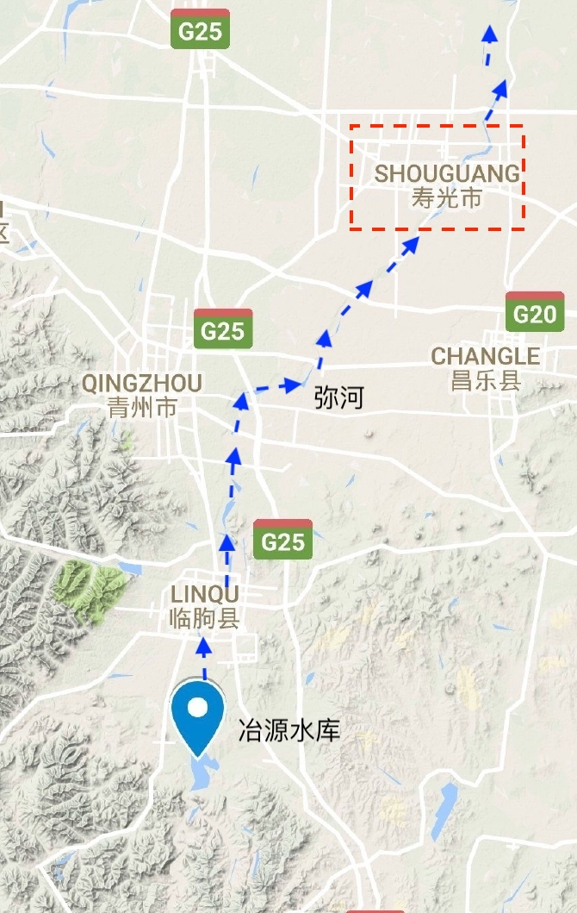

yeyuan\_review
================
Wenlong Liu
9/6/2018

**长文枯燥预警，本文从严禁角度出发，趣味性稍显不足，请慎入**

## 1\. 前言

前几天写的一篇回答突然成了爆款文，这让笔者始料不及。由于当时数据不足，时间有限，同时广大知友提出了很多疑问，笔者从新开一篇文章，详细复盘一下冶源水库(数据相对最充足)的操作，以期待澄清更多的误会。

在全文之前，有几点前期准备工作，希望大家认真读一下:

1.  **请不要开“上帝视角”**

在洪水过程中，所有人都是缺乏信息的，当时的人不知道雨什么时候来(天气预报啥时候准过？)、不知道雨啥时候走、不知道下半年会是干旱还是继续洪涝，所以所有的操作都是从最稳妥的角度出发的。笔者会在下文章详细分析每个可能操作的原因。

2.  **天气预报不能作为洪水调度的决定性依据**

原因很简单，准确度不高。这里不是在低估气象工作者的工作，大气系统变化非常迅速，精确地实时预测天气状况本来就是非常具有挑战性的工作，希望大家理解。

3.  **水库保障安全的最大优先级是自身的大坝**

继续强调这一点。

4.  **水库不仅可以拦蓄洪水，更可以调峰滞峰**

水库防洪不仅仅是将洪水存在水里，而且可以调涨洪峰的最大值和出现时间，以减少洪峰造成的伤害。

## 2\. 数据来源和处理方法

### 2.1 冶源水库和寿光区地理位置

<!-- -->

### 2.2 数据来源

本文数据分为三部分：山东水文站的网站、某位知友的视频截图和网上的各种公开信息。

  - 水文站的数据是实时更新的，不过可以写一个爬虫(即自动搜索下载插件)来搜索往期的数据，具体细节不表。

  - 某位知友的数据截取某当地专家公开的数据，笔者校验过，虽然入流数据存在一些误差，但是还在允许范围内；出流数据准确度很高。数据精度为一小时，能够提供更多细节。

  - 网上的公开信息主要参考某位知友的答案，同时提供一些辅助信息。

### 2.3 水位流量关系图

一般水库的水位流量关系图是查不到的，笔者根据山东水文站的数据，拟合了一个水位流量关系曲线。需要注意的是，这个估计是可能存在一些误差的。

### 2.4 时间轴

本文主要依据洪水发展的时间轴进行的，从2018年8月16日开始至2018年8月22日结束，其中8月19日8时至8月22日8时是本文分析的重点时期，笔者根据相关的泄洪操作将这72小时分为
